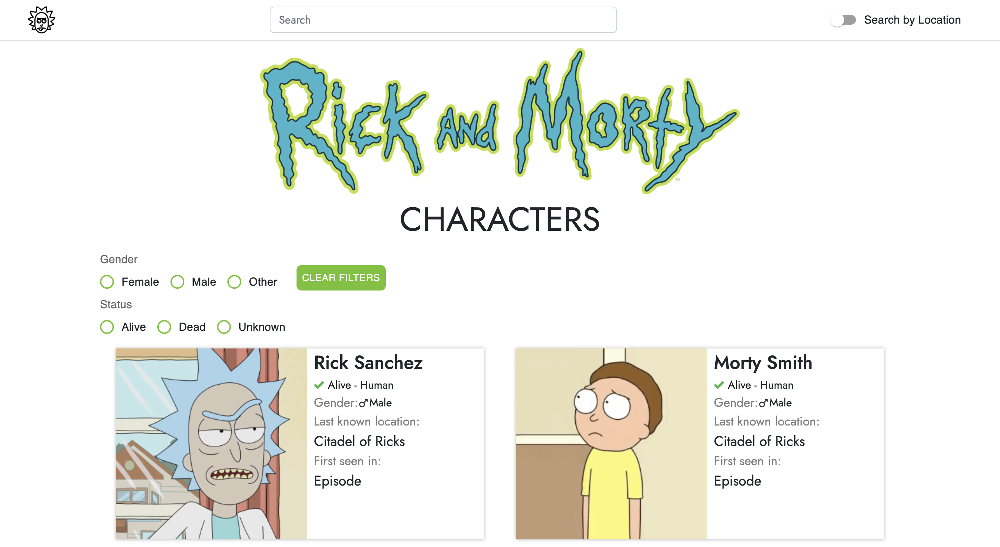

# Rick and Morty Characters Explorer 📺🔫

In this app you can find out more about all characters from that amazing series.

## Tech Stack

**Client:** React(Hooks), React-Bootstrap, RTK-Query


## Features

- Search by characters and locations names
- Filtering
- Animation
- Pagination


## FAQ

#### How long has it been in development?

Development took about a 4 days


## Screenshots




## Run Locally

Clone the project

```bash
  git clone https://github.com/thatsfov1/rick-and-morty-characters.git
```

Go to the project directory

```bash
  cd rick-and-morty-characters
```

Install dependencies

```bash
  npm install
```


